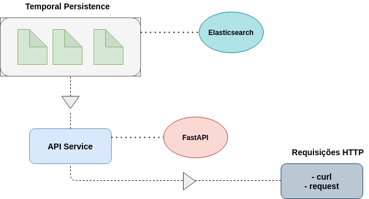

# API Vendas

API RestFul para disponibilização de dados de vendas de produtos. O diagrama a seguir representa a arquitetura da API, contendo três principais componentes
- **Temporal Persistence** : Arquivos que foram coletados, processados e estão disponíveis no Elasticsearch.
- **API Service** : API restful que irá fazer as requisições do elasticsearch para consumo de dados.
- **Request HTTP**: Consumo da API através de linhas de comandos ou de requests.

# Módulos API
A API consome dados que estão armazenados no Elasticsearch Clound, uma ferramenta de busca indexada. Os dados foram coletados e processados, antes de serem armazenados no elasticsearch.

- **elastic.py** : script de serviço que faz a conexão com a clound do elasticsearch e disponibiliza um client para o consumo de dados armazendados na clound.
- **main.py**: script responsável pela criação da API restful, elas faz utlização do FastAPI (uma biblioteca python para criação de api rest). A partir desse arquivo que as visões e informações serão disponíveis pela API.

# Arquivos de configuração
 - **Procfile** : O procfile é um arquivo de configuração responsável pela execução da API no Heroku.
 - **requirements.txt**: arquivo txt contendo as dependências que são utilizadas na build da API.
 - **Dockerfile**: arquivo utilizado para testes de build e funcionamento local da API.

# Consumo da API
A API está disponível em um cluster no Heroku e pode ser acessada pelo link:
- `https://fastapi-vendas-bemol.herokuapp.com/`

## Teste consumo API
Os dados das vendas podem ser consumidos através de comandos bash da seguinte forma:
- `curl https://fastapi-vendas-bemol.herokuapp.com/vendas`

Ou através de uma linguagem de programação como python, como no exemplo em [Teste-API](./teste-api/Teste-API.md)